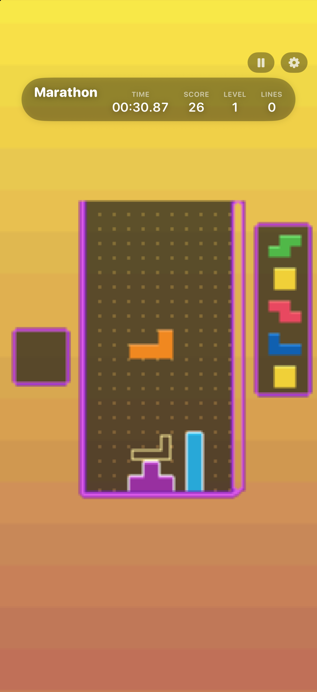

# Apotris for iPhone & Apple Vision Pro

Play **Apotris** — a fast, feature-packed block-stacking game — natively on your
iPhone, iPad, and Apple Vision Pro. Marathon, Sprint, Ultra, Dig, Blitz, Zen and
more, with the responsive controls and deep customization the game is known for.
100% vibe coded with lots of passion and attention to detail.

Built on [Apotris](https://apotris.com) by akouzoukos, running natively through
Metal — no emulator, the game's own engine rebuilt for Apple platforms.

<p align="center">
  
</p>

---

## Install

**Add the SideStore source** — the easiest path, and Apotris auto-updates when new versions ship:

| Device | Source URL |
| --- | --- |
| iPhone / iPad | `https://raw.githubusercontent.com/rebelancap/apotris-ios/main/sidestore/apps-ios.json` |
| Apple Vision Pro | `https://raw.githubusercontent.com/rebelancap/apotris-ios/main/sidestore/apps-visionos.json` |

In [SideStore](https://sidestore.io) / [AltStore](https://altstore.io): *Sources → **+** → paste the URL*, then install Apotris.

On **Apple Vision Pro**, first install SideStore onto the headset with
[iloader](https://github.com/rebelancap/iloader/releases#release-visionos) (SideStore/AltStore can't be
installed on visionOS the usual way — iloader is what gets SideStore there). Then add the source in SideStore
exactly as above. No Xcode or Dev Strap required.

**Prefer a manual install?** Download `Apotris-*-iOS.ipa` / `Apotris-*-visionOS.ipa` from the
[latest release](../../releases/latest) and install it through SideStore/AltStore yourself (iPhone / iPad can
also use [Sideloadly](https://sideloadly.io)).

Apotris is fully free and open — the app is complete, there's nothing extra to add.

## Controls

**iPhone / iPad — gestures (default).** The whole screen is the surface:

- **Drag** left/right to move · **drag down** to soft drop · **flick down** to hard drop
- **Tap** the right / left half to rotate CW / CCW · **two-finger tap** for 180°
- **Swipe up** to hold · **long-press** for Zone
- In menus the same gestures flip automatically: tap = confirm, two-finger = back, swipes navigate

Prefer buttons? A GB-style on-screen **d-pad + A/B/L/R** overlay with haptics is a toggle in
Settings (Gestures / Buttons / Both).

**Apple Vision Pro.** Pinch-tap with your **right hand** to rotate CW, **left hand** CCW;
pinch-drag to move / soft-drop / flick to hard-drop; a bottom ornament has pause / hold /
rotate for eye-and-pinch.

**Everywhere:** full **game controller** and **hardware keyboard** support through the game's own
remappable bindings; controller rumble.

## Features

- Every offline mode: **Marathon, Sprint, Dig, Ultra, Blitz, Combo, Zen, Master, Death, Training**, and **battle vs CPU**
- The full skin / palette / gradient customization, soundtrack, and detailed stats
- **Gestures, GB buttons, controller, keyboard** — pick your input and remap freely
- **Display filters:** Sharp (crisp pixels), LCD (handheld grid), CRT (scanlines)
- 60 / 120 Hz (ProMotion), native settings that persist
- **Apple Vision Pro:** a crisp, free-resizing window with chirality pinch controls and a native control ornament

## Requirements

- iPhone / iPad on **iOS 17+**, or **Apple Vision Pro** (visionOS 2+)
- A sideloading tool (SideStore / AltStore) ([iloader](https://github.com/rebelancap/iloader/releases#release-visionos) for visionOS)

## FAQ

**Is this an emulator?** No — it's Apotris's own engine (the Tilengine renderer and SoLoud audio)
rebuilt natively for Apple platforms and presented through Metal.

**Multiplayer?** Online multiplayer isn't in this build yet; all offline modes and CPU battles are here.

**The app stopped launching after about a week?** Apps sideloaded with a free Apple account expire
after 7 days (paid developer accounts last a year). SideStore / iloader refresh them automatically in
the background — open the sideloading app and let it re-sign.

---

## Building from source

Requires macOS with Xcode, plus `meson`, `ninja`, and `xcodegen`
(`brew install meson ninja xcodegen`).

```sh
scripts/bootstrap.sh                 # clone + pin upstream Apotris into vendor/
scripts/build-ios-core.sh ios-sim    # cross-build the core (simulator)
cd app && xcodegen generate
xcodebuild -project Apotris.xcodeproj -scheme Apotris \
  -destination 'platform=iOS Simulator,name=iPhone 17' build
```

Upstream Apotris is vendored unmodified and pinned by commit; every local change is a small
`#ifdef IOS`-gated patch in `overlay/patches/` (regenerated by `scripts/gen-patches.py`, which
asserts each edit's match count). The frame-level architecture map is in `docs/frame-map.md`, the
control design in `docs/controls.md`, and the upstream-update process in `docs/updating.md`.

## Credits & license

- [Apotris](https://apotris.com) by **akouzoukos** and contributors — the game and its engine
- This iOS / visionOS port by [rebelancap](https://github.com/rebelancap)
- Licensed under the **GNU AGPL v3** (see `COPYING`), matching upstream Apotris. The full source for
  this port is this repository.
